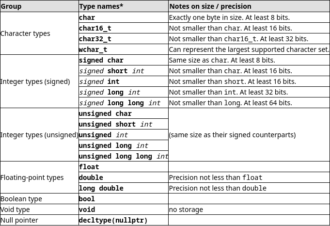
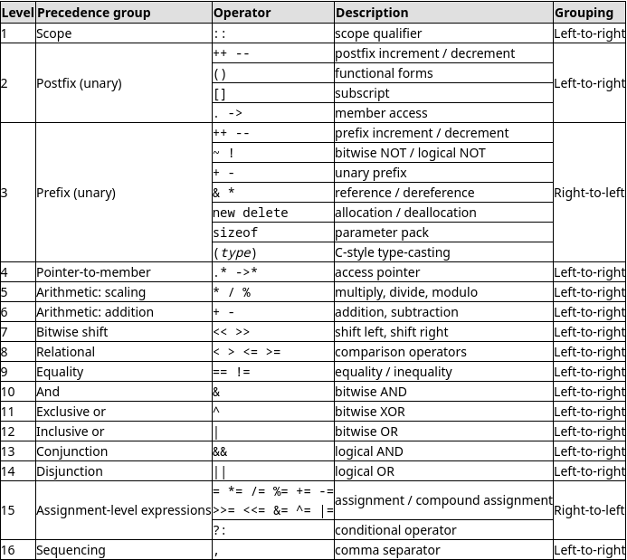

# Estudo de Caso: C++

## Histórico

No ano de 1979, em sua tese de PhD,  Bjarne Stroustrup trabalhou muito com a linguagem de programação Simula 67, uma das primeiras a suportar o paradigma orientado a objetos. Bjarne norou que esse paradigma era muito útil no desenvolvimento de software, porem a linguagem simula era muito lenta para uso prático.

Apos isso, Bjarne começou a trabalhar no o_C com Classes_, um superset da linguagem C que tentava adicionar funcionalidades de linguagens orientadas a objetos na linguagem C, que e conhecida pela sua performance e utilidade em programação de baixo nível.

O primeiro compilador do C com classes foi chamado de Cfront, que também foi escrito em C com classes. Porem, o C com Classes foi abandonado em 1993 apos se tornar dificilmente extensível.

Em 1983, o nome da linguagem foi mudado para C++. Varias features foram adicionadas junto a essa mudança, como funções virtuais, sobrecarga de funções, referencias a variáveis com o símbolo & e a palavra reservada const.

Em 1985, Stroustup publicou o livro referencia para a linguagem c++, chamado de The C++ Programming Language.

Em 1998, o comitê de padronização do C++ publicou o primeiro padrão internacional da linguagem, conhecido como o padrão C++98. Em 2003 esse padrão foi revisado, e foram adicionadas mais features na linguagem, mais notavelmente a Standard Template Library (STL), essa versão foi chamada de C++03.

Na metade de 2011, o padrão C++11 foi finalizado. A Biblioteca Boost teve um impacto considerável nas features adicionadas nesse padrão, com ate alguns módulos sendo adicionados diretamente da boost. Algumas das features adicionadas nesse padrão foram o suporte a expressões regulares, uma biblioteca de randomizacao, uma nova biblioteca para trabalhar com tempo, suporte a operações atômicas, uma biblioteca de multi threading, uma nova sintaxe de loops for (igual o foreach), a palavra-chave auto, novas classes de container, além de muitas outras.

Atualmente, o padrão vigente e o C++20. Algumas das features de padrão são o operador de comparação em 3 vias (), melhorias na utilização de funções lambda, coroutines, módulos e muitas outras.

Existem planos para um padrão futuro chamado C++23, com muitas mudanças planejadas.

## Objetivos, Contextualização e Características

O C++ e uma linguagem de alto nível, com ferramentas para se trabalhar em baixo nível também, compatível com o C e com uma extensível biblioteca tanto padrão quanto da comunidade.

Ate certo nível o C++ e portável, pois existem diversos compiladores para várias arquiteturas que fazem com que código C++ seja compilado e rodado em várias arquiteturas com pouca ou nenhuma modificação.

### Compilação

A linguagem C++ e compilada, ou seja, o compilador traduz código escrito em C++ para o código de máquina da arquitetura alvo. Essa compilação e feita de uma só vez. Além disso, o compilador pode aplicar otimizações de código, resultando em um código de máquina mais rápido e/ou confiável.

### Nível de abstração

A linguagem C++ e uma linguagem de programação de alto nível, ou seja, oferece uma série de abstrações para facilitar o entendimento para humanos, como funções e objetos. Porem, com o C++ também e possível realizar manipulações de baixo nível, inclusive sendo uma ótima linguagem para isso.

### Sistema de tipos

#### Forte ou Fraca

C++ e fortemente tipada, ou seja, possui bastante restrições quanto a conversão de tipos entre variáveis. Por exemplo, não e possível a conversão entre um Int e um objeto Fruit.

#### Inferência

O C++ suporta tanto a inferência implícita, que e baseada no contexto que aquela variável e usada, quanto a inferência explicita, na qual o programador diz o tipo da variável.

#### Checagem

Novamente, o C++ suporta tanto a checagem estática quanto a checagem dinâmica, ou seja, os seus tipos são checados em tempo de compilação e também em tempo de execução.

#### Segurança de tipos

A linguagem C++ não e type unsafe, ou seja, ela leva em consideração que o programador sabe o que esta fazendo e permite operações de conversão de tipos que podem levar a erros em tempo de execução.

### Paradigmas

A linguagem C++ e multi paradigma, ou seja, suporta diversos paradigmas e técnicas no mesmo programa. Alguns dos paradigmas que o C++ suporta são: Procedural, genérico, orientado a objetos e mais recentemente o funcional.

## Tour pela linguagem

### Compiladores

Como dito anteriormente, o compilador e o software que traduz código feito em C++ para código de máquina. Atualmente, os dois compiladores mais maduros de C++ sao o GCC e o Clang (frontend do llvm).

Para compilar e rodar um programa em C++ podemos rodar no terminal o comando: 1

bash
clang++ -std=c++11 -stdlib=libc++ hello.cpp -o hello
./hello


Podemos usar o `Make` para facilitar nossa vida.

### Estrutura de um programa

Um programa simples em C++ segue a seguinte estrutura:

cpp
// Headers e modulos
#include <iostream>

// Função principal: Retorno e corpo
int main() {
  // Expressão simples
  std::cout << "Hello, World!" << std::endl;
  // Retorno
  return 0;
}


### Keywords, Tipos e variaveis

#### Keywords

As seguintes expressões são palavras reservadas em C++ e portanto não podem ser usados como nome de variáveis:

text
alignas, alignof, and, and_eq, asm, auto, bitand, bitor, bool,
break, case, catch, char, char16_t, char32_t, class, compl,
const, constexpr, const_cast, continue, decltype, default,
delete, do, double, dynamic_cast, else, enum, explicit,
export, extern, false, float, for, friend, goto, if, inline,
int, long, mutable, namespace, new, noexcept, not, not_eq,
nullptr, operator, or, or_eq, private, protected, public,
register, reinterpret_cast, return, short, signed, sizeof,
static, static_assert, static_cast, struct, switch, template,
this, thread_local, throw, true, try, typedef, typeid,
typename, union, unsigned, using, virtual, void, volatile,
wchar_t, while, xor, xor_eq


#### Tipos de dados fundamentais

Tipos de dados fundamentais sao tipos básicos implementados pela linguagem utilizados para representar unidades de armazanemento atomicas. No C++ temos os seguintes tipos de dados fundamentais:



A declaração de variáveis e feita da seguinte forma:

cpp
// variáveis
#include <iostream>

/** Namespacing
    Dividir declaração de símbolos em "pacotes",
    para evitar conflitos de nomes.
*/
using namespace std;

int main() {
  // declaração de variáveis com valores padrões
  int a(8), b = 12, c{21};
  // declaração de variáveis nao inicializadas
  float result, d;

  // atribuição de valores
  d = -48.0f;
  // operações aritméticas (com type casting)
  result = float(((a - b) * c)) / d;

  cout << result;
  return 0;
}


A dedução de tipos no C++ e feita utilizando as palavras reservadas `auto` e `decltype`:

cpp
#include <iostream>

/* Função anonima (aka lambda) sendo atribuida a uma variável
   O seu tipo de retorno e inferido pelo compilador(utilização do auto)
*/
auto fn = []() {
  return 42;
};

auto main() -> int {
  // inferência de tipos em c++
  auto result = fn();
  decltype(result) result2 = result + 10;

  std::cout << result << std::endl;
  std::cout << result2 << std::endl;
  return 0;
}


#### Tipos de dados compostos

O C++ possui uma rica biblioteca de tipos de dados compostos. Um exemplo e a classe `string`, que armazena sequencias de caracteres:

cpp
#include <iostream>
#include <string>

int main() {
  std::string s = "Hello, World!";
  std::cout << s << std::endl;


  // sequencia de caracteres
  for (auto c : s) {
    std::cout << c;
  }
  std::cout << std::endl;

  /* string e uma classe de dados
     Portanto possui muitos metodos
  */
  s.push_back(' ');
  s.replace(0, 5, "Hola");
  s.append("I'm a string");

  std::cout << s << std::endl;

  return 0;
}


#### Constantes

No C++ podemos definir expressões com valores fixos de 4 formas: com o `pre-processador`, com a palavra reservada `const`, com a palavra reservada `constexpr` e com valores literais.

cpp
#include <iostream>

#define PI 3.14159265358979323846
const double E = 2.71828182845904523536;
constexpr double PHI = 1.61803398874989484820;

int main() {
  std::cout << "pi = " << PI << std::endl;
  std::cout << "e = " << E << std::endl;
  std::cout << "phi = " << PHI << std::endl;
  std::cout << "mi = " << 1.84775906502257351225f << std::endl;
  return 0;
}


#### Operadores

O C++ possui uma vasta lista de operadores, alguns deles sao:

cpp
#include <iostream>

using namespace std;

int main() {
  // Operadores de atribuicao
  int a = 1, b = 2;

  // Operadores aritmeticos
  cout << a << " + " << b << " = " << a + b << endl;
  cout << a << " - " << b << " = " << a - b << endl;
  cout << a << " * " << b << " = " << a * b << endl;
  cout << a << " / " << b << " = " << a / b << endl;
  cout << a << " % " << b << " = " << a % b << endl;
  cout << a << " ^ " << b << " = " << (a ^ b) << endl;

  // Operadores de atribuicao composta
  cout << "a += b = " << (a += b) << endl;
  cout << "a -= b = " << (a -= b) << endl;
  cout << "a *= b = " << (a *= b) << endl;
  cout << "a /= b = " << (a /= b) << endl;
  cout << "a %= b = " << (a %= b) << endl;
  cout << "a ^= b = " << (a ^= b) << endl;
  cout << "a &= b = " << (a &= b) << endl;
  cout << "a |= b = " << (a |= b) << endl;
  cout << "a <<= b = " << (a <<= b) << endl;
  cout << "a >>= b = " << (a >>= b) << endl;

  // Operadores de incremento e decremento
  cout << "a++ = " << (a++) << endl;
  cout << "++a = " << (++a) << endl;

  // operadores de comparacao
  cout << "a == b = " << (a == b) << endl;
  cout << "a != b = " << (a != b) << endl;
  cout << "a < b = " << (a < b) << endl;
  cout << "a > b = " << (a > b) << endl;
  cout << "a <= b = " << (a <= b) << endl;
  cout << "a >= b = " << (a >= b) << endl;

  // Operadores logicos
  cout << "a && b = " << (a && b) << endl;
  cout << "a || b = " << (a || b) << endl;
  cout << "!a = " << (!a) << endl;

  // Operadores de bitwise
  cout << "a & b = " << (a & b) << endl;
  cout << "a | b = " << (a | b) << endl;
  cout << "a ^ b = " << (a ^ b) << endl;
  cout << "~a = " << (~a) << endl;
  cout << "a << b = " << (a << b) << endl;
  cout << "a >> b = " << (a >> b) << endl;

  // Operador ternario
  cout << "a ? b : c = " << (a ? b : 0) << endl;

  // operadores de cast
  cout << "(int)a = " << (int)a << endl;
  cout << "(double)a = " << (double)a << endl;
  cout << "(char)a = " << (char)a << endl;

  return 0;
}


As regras de precendencia de operadores sao mostradas a seguir:




#### Entrada e saída

A biblioteca padrão do C++ define o header `<iostream>` como padrão para operações simples de entrada e saída. Além disso, temos o header `<sstream>` que lida com operações de streams em strings:

cpp
#include <iostream>
#include <sstream>
#include <string>

int main() {
  std::string a, b, c, str_int("123");
  int int_a;

  // io simples
  std::cout << "Digite uma palavra: ";
  std::cin >> a;
  std::cout << "Digite outra palavra: ";
  std::cin >> b;
  std::cout << a << " + " << b << " = " << a + b << std::endl;

  // ler uma linha inteira
  std::cout << "Digite uma linha: ";
  std::getline(std::cin, c);
  std::getline(std::cin, c);
  std::cout << c << std::endl;

  // stringstream
  std::cout << "converte string para inteiro: ";
  std::stringstream(str_int) >> int_a;
  std::cout << int_a << std::endl;
  return 0;
}


#### Controle de Fluxo e Loops

A linguagem possui os comandos de seleção padrão: `if`, `else if`, `else` e o `switch case`. Além disso, possui também os loops `for`, `while` e `do while`. Para a utilização em loops, temos os comandos de alteração de fluxo `continue`, `break` e `goto`. Exemplos desses comandos podem ser vistos a seguir:

cpp
#include <iostream>
#include <string>

int main() {
  std::string nome("Joao");
  int idade = 30;
  int altura = 1.75;
  char sexo = 'M';

  // if, else if, else
  if (idade < 18) {
    std::cout << "Voce e menor de idade" << std::endl;
  } else if (idade >= 18 && idade <= 65) {
    std::cout << "Voce e adulto" << std::endl;
  } else {
    std::cout << "Voce e idoso" << std::endl;
  }

  // switch
  switch (sexo) {
  case 'M':
    std::cout << "Voce e do sexo masculino" << std::endl;
    break;
  case 'F':
    std::cout << "Voce e do sexo feminino" << std::endl;
    break;
  default:
    std::cout << "Voce e do sexo desconhecido" << std::endl;
    break;
  }

  // while
  int i = 0;
  while (i < 10) {
    std::cout << i << std::endl;
    i++;
  }

  // do while
  i = 0;
  do {
    std::cout << i << std::endl;
    i++;
  } while (i < 10);

  // for
  for (int j = 0; j < 10; j++) {
    std::cout << j << std::endl;
  }

  // for (auto)
  for (auto c : nome) {
    std::cout << "[" << c << "]" << std::endl;
  }

  // jumps
  for (int k = 0; k < 10; k += 2) {
    if (k == 5) {
      continue;
    } else if (k == 7) {
      break;
    } else {
      std::cout << k << std::endl;
    }
  }
}
#### Funcoes

A sintaxe para definicao de funcoes e a seguir:

```cpp
type name ( parameter1, parameter2, ...) { statements }
```

Aqui `type` e o tipo de retorno da funcao, `name` e seu nome, `(parameter1, parameter2, ...)` sao os parametros da funcao (cada um com o seu tipo) e `statements` e o corpo da funcao.

Tanto nos parametros quanto no tipo de retorno, podemos usar modificadores, como o const e o inline, que alteram atributos desses valores e permitem ao compilador realizar algumas alteracoes e otimizacoes.

No _C++_ tambem temos funcoes anonimas (aka lambda), que facilitam algumas operacoes e oferecem de linguagens funcionais ao _C++_.

Alem disso, podemos passar parametros por valor, onde e feita uma copia da variavel, ou por referencia, onde o endereco da variavel e passado no lugar de seu valor.

```cpp
#include <functional>
#include <iostream>

/* Funcao simples com dois parametros
   passados por valor(possui valores padroes) */
int subtraction(int a = 0, int b = 0) { return a - b; }

// Funcao sem parametros e sem retorno, tambem chamada de procedimento
void printmessage() { std::cout << "I'm a function!"; }

/* Passando valores por referencia (em C usariamos ponteiros para essas
   variaveis) */
void duplicate(int &a, int &b) {
  a *= 2;
  b *= 2;
}

/* Modificadores podem ser usados para alterar o comportamento
 * de parametros ou do retorno da funcao
 * inline = o compilador nao fara o stacking da funcao, so chamara ela
 * const = o compilador tera certeza que valor nao sera modificado
 */
inline const std::string concatenate(const std::string &a,
                                     const std::string &b) {
  return a + b;
}

auto main() -> int {
  int a = 5, b = 10;
  std::string s1 = "Hello", s2 = "World";

  /* Exemplo de recursividade, escopo e funcao anonima */
  const std::function<const int(const int)> factorial =
      [&factorial](const int n) { return n == 0 ? 1 : n * factorial(n - 1); };

  std::cout << "Subtraction of " << a << " and " << b << " is "
            << subtraction(a, b) << std::endl;

  printmessage();
  duplicate(a, b);

  std::cout << "Concatenation of " << s1 << " and " << s2 << " is "
            << concatenate(s1, s2) << std::endl;

  std::cout << "Factorial of " << a << " is " << factorial(a) << std::endl;

  return 0;
}
```

#### Templates e Sobrecarga de funcoes

No _C++_, diferentes funcoes podem ter o mesmo nome se o tipo de dados de seus parametros sao diferentes, ou seja, essas funcoes estao `sobrecarregadas`. Podemos usar isso para criar um polimorfismo de parametros para uma funcao.

Outra maneira de atingir esse polimorfismo e utilizar `templates de funcoes`, onde uma funcao e "gerada" para um tipo especifico. A sintaxe para template functions e a seguinte:

```cpp
template <template-parameters> function-declaration
```

Um exemplo dessas propriedades pode ser visto a seguir:

```cpp
#include <iostream>

/* Dependendo do tipo dos parametros
  uma das funcoes sera chamada
*/
const int add(const int a = 0, const int b = 0) {
  std::cout << "int overloading add" << std::endl;
  return a + b;
}
const float add(const float a = 0, const float b = 0) {
  std::cout << "float overloading add" << std::endl;
  return a + b;
}

template <typename T> const T add(const T a, const T b) {
  std::cout << "template overloading add" << std::endl;
  const T result = a+b;
  return result;
}

int main() {
  std::cout << "int addd: " << add(1, 2) << std::endl;
  std::cout << "float add: " << add(1.0f, 2.0f) << std::endl;
  std::cout << "template add: " << add<std::string>("a", "b")
            << std::endl;
}
```

#### Escopo e Namespaces

No _C++_ temos o escopo global, escopo de bloco, escopo de funcoes e escopo por `Namespaces`. Namespaces permitem o agrupamento de simbolos em escopos relacionados para evitar o conflito com escopos maiores. A palavra chave `using` introduz um simbolo no escopo atual, por exemplo, podemos inserir o nome `a` que pertence ao escopo `ns1` dentro de outro escopo.

```cpp
#include <iostream>

int a = 0;
float b = 0;

namespace ns1 {
int a = 1;
float b = 2.0f;
} // namespace ns1

namespace ns2 {
int a = 3;
float b = 4.0f;
std::string c = "4";
} // namespace ns2

void fn(void) {
  int a = 4;
  float b = 4.0f;

  std::cout << "fn a: " << a << std::endl;
  std::cout << "fn b: " << b << std::endl;
}

void fn2(void) {
  using namespace ns2;

  std::cout << "introduced ns1 c: " << c << std::endl;
}

int main() {
  fn();
  std::cout << "global a: " << a << std::endl;
  std::cout << "global b: " << b << std::endl;
  std::cout << "ns1 a: " << ns1::a << std::endl;
  std::cout << "ns1 b: " << ns1::b << std::endl;
  std::cout << "ns2 a: " << ns2::a << std::endl;
  std::cout << "ns2 b: " << ns2::b << std::endl;
}
```

Variaveis globais tem `armazenamento estatico`, ou seja, sao alocadas durante toda a execucao do programa. Ja variaveis locais tem o `armazenamento automatico`, onde a variavel e desalocada quando o fluxo sai daquele escopo.


#### Arrays

Arrays sao espacos de memoria continuos que contem o mesmo tipo de dados. A sintaxe para definir um array de um tipo especifico de dados e a seguinte:

```cpp
type name [elements];
```

Um exemplo da utilizacao de arrays:

```cpp
#include <iostream>

// exemplo de funcao que recebem um array
int sum(int a[], int n) {
  int sum = 0;
  for (int i = 0; i < n; i++) {
    sum += a[i];
  }
  return sum;
}

int main() {
  // Array de inteiros, nao inicializados
  int a[10];

  // Array de inteiros, inicializados
  int b[10] = {1, 2, 3, 4, 5, 6, 7, 8, 9, 10};

  // Array de inteiros, multidimensionais
  int c[2][3] = {{1, 2, 3}, {4, 5, 6}};

  for (int i = 0; i < 10; i++) {
    // escrita em uma posicao do array
    a[i] = i;
  }

  for (int i = 0; i < 10; i++) {
    std::cout << a[i] << std::endl;
  }

  std::cout << sum(a, 10) << std::endl;

  for (int i = 0; i < 10; i++) {
    std::cout << b[i] << std::endl;
  }
  return 0;
}
```


#### Ponteiros

Ponteiros sao referencias para posicoes de memoria que possuem um valor armazenado, que inclusive, podem ser outros ponteiros. Usamos o caractere `&` para o endereco de um ponteiro e `*` para o valor dele. Alem disso, podemos utilizar os operadores `++` e `--` para realizar a aritmetica de ponteiros.

```cpp
// exemplo de ponteiros
#include <iostream>

using namespace std;

void increment_all(int *start, int *stop) {
  int *current = start;
  while (current != stop) {
    ++(*current); // incrementa o valor do ponteiro
    ++current;    // incrementa o endereco do ponteiro
  }
}

void print_all(const int *start, const int *stop) {
  const int *current = start;
  while (current != stop) {
    cout << *current << '\n';
    ++current; // incrementa a posicao de memoria do ponteiro
  }
}

int main() {
  int numbers[] = {10, 20, 30};
  increment_all(numbers, numbers + 3);
  print_all(numbers, numbers + 3);
  return 0;
}
```

#### Memoria Dinamica

Em `C`, era usado as funcoes da familia `*alloc()` e `free()` para a alocacao/desalocacao dinamica de memoria. No `C++` foi introduzido novos operadores para a gerencia de memoria dinamica na linguagem:

```cpp
pointer = new type
pointer = new type [number_of_elements]

e

delete pointer;
delete[] pointer;
```

Um exemplo da utilizacao desses operadores:

```cpp
#include <iostream>

int main() {
  // criacao de um arr  ay de inteiros utilizando o new
  int *p = new int[10];

  for (int i = 0; i < 10; i++) {
    p[i] = i;
  }

  for (int i = 0; i < 10; i++) {
    std::cout << p[i] << std::endl;
  }

  // destruicao do array criado utilizando o delete
  delete[] p;
}
```

#### Structs

O C++ herdou as `structs` do C, que sao um agrupamento de dados relacionados. Porem, como C++ e uma linguagem orientada a objetos, a struct e um sinonimo de classes. A sintaxe para definir uma struct e a seguinte:

```cpp
struct type_name {
  member_type1 member_name1;
  member_type2 member_name2;
  member_type3 member_name3;
  .
  .
} object_names;
```

Exemplo de utilizacao:

```cpp
// exemplo de utilizacao de structs em c++
#include <iostream>

/* structs sao definidas com a palavra reservada struct
   Note a utilizacao da palavra chave using para a definicao do tipo
*/
using Point = struct {
  int x;
  int y;
};

int main() {
  Point p;
  p.x = 10;
  p.y = 20;
  std::cout << p.x << " " << p.y << std::endl;
  return 0;
}
```

## Referencias

https://cplusplus.com/info/history/

https://en.cppreference.com/w/cpp/20

https://www.programmerall.com/article/2405560816/

https://m.cplusplus.com/info/description/

https://m.cplusplus.com/doc/tutorial/introduction/
